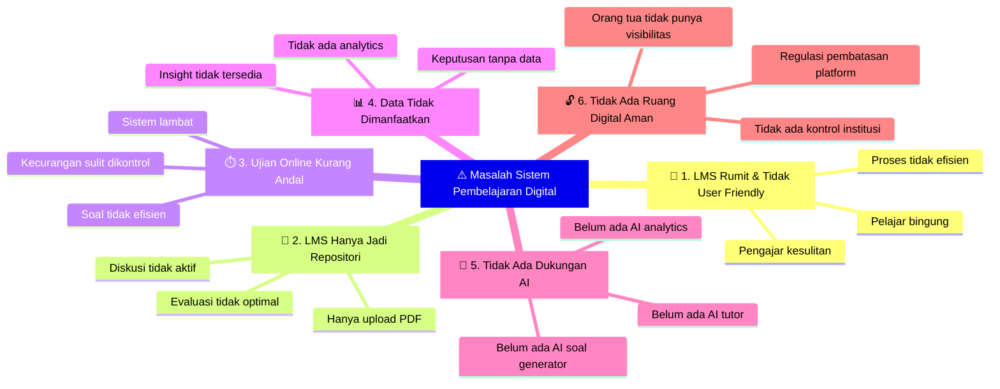

# The Problem

## **Sistem Pembelajaran Digital Saat Ini Belum Optimal**

Walaupun banyak institusi pendidikan telah menggunakan Learning Management System (LMS), pada praktiknya sistem tersebut sering kali tidak dimanfaatkan secara maksimal.

Banyak LMS saat ini terlalu kompleks, kurang intuitif, dan tidak memanfaatkan data maupun AI untuk meningkatkan kualitas pembelajaran.

Beberapa masalah yang sering terjadi antara lain:

---

### 1. LMS Terasa Rumit dan Tidak User Friendly

Banyak LMS memiliki tampilan yang kompleks dan sulit digunakan oleh pengajar maupun pelajar.

Akibatnya:

- Pengajar kesulitan mengelola materi
- Pelajar bingung cara penggunaan nya
- Proses belajar menjadi tidak efisien

Banyak institusi menggunakan platform seperti Moodle, namun konfigurasi yang rumit dan tampilan yang kurang modern membuat pengalaman pengguna tidak optimal.

### 2. Penggunaan LMS di Institusi Pendidikan Sering Tidak Maksimal

Dalam banyak kasus:

- Pengajar hanya mengunggah file PDF
- Fitur diskusi jarang digunakan
- Evaluasi pembelajaran tidak optimal

LMS akhirnya hanya menjadi **repositori materi**, bukan sistem pembelajaran yang aktif.

### 3. Sistem Ujian Online yang Kurang Andal

Banyak institusi masih menghadapi masalah dalam ujian digital:

- Sistem lambat saat banyak peserta
- Pengelolaan soal yang tidak efisien
- Analisis hasil ujian terbatas
- Potensi kecurangan sulit dikontrol

Padahal assessment adalah bagian penting dalam proses pembelajaran.

### 4. Data Pembelajaran Tidak Dimanfaatkan

Setiap aktivitas belajar menghasilkan data penting, seperti:

- Tingkat partisipasi pelajar
- Progres pembelajaran
- Performa ujian
- Engagement terhadap materi

Namun, sebagian besar LMS tidak menyediakan **analytics yang membantu institusi memahami proses belajar secara mendalam**.

### 5. Tidak Ada Dukungan AI dalam Proses Pembelajaran

Teknologi AI membuka peluang baru dalam pendidikan, seperti:

- Membantu pelajar memahami materi
- Membantu pengajar membuat soal
- Menganalisis performa pembelajaran

Namun, sebagian besar LMS saat ini belum mengintegrasikan AI secara efektif.

### 6. Belum Ada Ruang Digital yang Aman dan Terkontrol untuk Kegiatan Belajar

Dengan diterbitkannya **Peraturan Menteri Komunikasi dan Digital Nomor 9 Tahun 2026**, pemerintah mulai membatasi akses anak di bawah 16 tahun ke platform digital berisiko tinggi seperti YouTube, TikTok, Instagram, dan lainnya.

Kondisi ini menimbulkan tantangan baru bagi institusi pendidikan:

- Pelajar kehilangan akses ke ruang digital yang selama ini digunakan untuk kegiatan belajar informal
- Institusi belum memiliki platform sendiri yang aman dan dirancang khusus untuk pembelajaran
- Orang tua tidak memiliki visibilitas terhadap aktivitas digital anak dalam konteks belajar
- Belum ada mekanisme yang memungkinkan orang tua memantau progres dan keterlibatan anak dalam proses pembelajaran secara digital

Di sisi lain, orang tua semakin membutuhkan **kontrol dan transparansi** terhadap aktivitas digital anak-anak mereka. Namun sebagian besar LMS yang ada saat ini tidak menyediakan fitur untuk melibatkan orang tua dalam memantau proses belajar.

## Closing Opportunity Statement

Akibat dari berbagai masalah tersebut, banyak institusi pendidikan belum mendapatkan manfaat maksimal dari sistem pembelajaran digital yang mereka gunakan.

Di saat yang bersamaan, regulasi pemerintah kini mendorong institusi untuk menyediakan **ruang digital yang aman, terkontrol, dan bertanggung jawab** bagi pelajar.

Dengan pendekatan yang lebih modern, sistem pembelajaran digital dapat menjadi **infrastruktur penting yang tidak hanya meningkatkan kualitas pendidikan, tetapi juga menjadi ruang digital yang aman bagi generasi muda.**