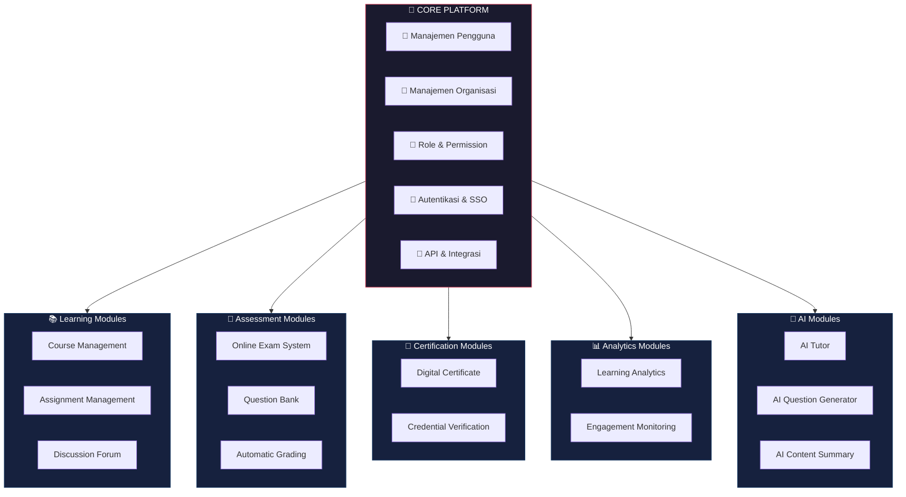

# Core Concept

**Modular Learning Platform**

Spinotek Learning System dirancang dengan pendekatan modular, di mana berbagai fitur pembelajaran disusun dalam bentuk modul yang dapat digunakan secara fleksibel oleh institusi.

Pendekatan ini memungkinkan institusi untuk mengadopsi sistem sesuai dengan kebutuhan mereka tanpa harus mengimplementasikan seluruh fitur sekaligus.

Dengan arsitektur modular, Spinotek Learning System dapat berkembang secara bertahap seiring dengan kebutuhan institusi.

## Arsitektur Modular

## Core Platform

Di pusat sistem terdapat **core platform** yang menjadi fondasi bagi seluruh modul.

Core platform menyediakan komponen dasar seperti:

- Manajemen pengguna
- Manajemen organisasi
- Role dan permission
- Sistem autentikasi
- API dan integrasi sistem

Core platform memastikan seluruh modul dapat bekerja secara konsisten dalam satu sistem yang terintegrasi.

## Modular Applications

Di atas core platform, berbagai modul pembelajaran dapat digunakan sesuai kebutuhan institusi.

Beberapa contoh modul yang dapat tersedia dalam Spinotek Learning System antara lain:

**Learning Modules**

- Course Management
- Assignment Management
- Discussion Forum

**Assessment Modules**

- Online Exam System
- Question Bank
- Automatic Grading

**Certification Modules**

- Digital Certificate
- Credential Verification

**Analytics Modules**

- Learning Analytics
- Student Engagement Monitoring

Dengan pendekatan ini, institusi dapat memilih modul yang relevan dengan kebutuhan mereka.

## Flexible Adoption

Pendekatan modular memberikan fleksibilitas bagi institusi dalam mengadopsi platform.

Sebagai contoh:

Sebagian institusi mungkin hanya membutuhkan **Online Exam System** untuk menyelenggarakan ujian digital.

Institusi lain mungkin membutuhkan sistem yang lebih lengkap, seperti:

- Learning Management
- Certification System
- Learning Analytics

Spinotek Learning System memungkinkan institusi untuk menggunakan modul secara bertahap sesuai dengan kebutuhan mereka.

## Integrated Ecosystem

Walaupun modul dapat digunakan secara terpisah, seluruh modul tetap terintegrasi dalam satu platform.

Hal ini memungkinkan data pembelajaran dari berbagai aktivitas dapat dikumpulkan dan dianalisis secara menyeluruh untuk memberikan insight yang lebih baik bagi institusi.

Dengan pendekatan ini, Spinotek Learning System dapat menjadi **ekosistem pembelajaran digital yang terintegrasi**.