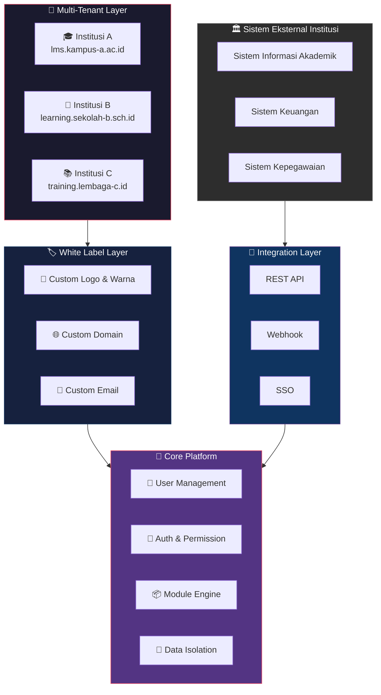

# Core Platform Architecture

**Fondasi Platform Pembelajaran Digital**

Spinotek Learning System dibangun di atas platform inti yang dirancang untuk mendukung berbagai modul pembelajaran dalam satu ekosistem yang terintegrasi.

Core platform ini memastikan bahwa seluruh modul dapat berjalan secara konsisten, aman, dan mudah diintegrasikan dengan sistem lain yang dimiliki oleh institusi.

Pendekatan ini memungkinkan Spinotek Learning System berkembang sebagai platform pembelajaran digital yang fleksibel dan scalable.

## Arsitektur Platform

---

## 1. Multi-Tenant Architecture

Spinotek Learning System dirancang dengan pendekatan **multi-tenant architecture** yang memungkinkan satu platform melayani banyak institusi secara bersamaan.

Setiap institusi memiliki lingkungan sistem yang terpisah, namun tetap berjalan di atas platform yang sama.

Dengan pendekatan ini, setiap institusi dapat memiliki:

- Domain khusus
- Identitas visual (logo dan warna)
- Struktur organisasi sendiri
- Data yang terisolasi dari institusi lain

Pendekatan ini memungkinkan sistem untuk melayani banyak institusi secara efisien tanpa harus mengelola kode yang berbeda untuk setiap implementasi.

## 2. White Label Branding

Spinotek Learning System mendukung **white label branding**, sehingga setiap institusi dapat menggunakan platform dengan identitas mereka sendiri.

Institusi dapat menyesuaikan:

- Logo institusi
- Warna tampilan
- Domain platform
- Identitas email sistem

Dengan pendekatan ini, platform dapat terlihat sebagai bagian dari ekosistem digital institusi tanpa harus menampilkan branding vendor secara dominan.

## 3. Integration Friendly

Institusi pendidikan biasanya telah memiliki berbagai sistem digital lain yang digunakan dalam operasional mereka, seperti:

- Sistem Informasi Akademik
- Sistem Keuangan
- Sistem Kepegawaian
- Sistem Perpustakaan

Spinotek Learning System dirancang agar mudah diintegrasikan dengan sistem-sistem tersebut melalui:

- REST API
- Webhook
- Single Sign-On (SSO)

Pendekatan ini memungkinkan Spinotek Learning System menjadi bagian dari ekosistem digital institusi yang lebih luas.

## 4. Scalable and Extensible

Core platform dirancang agar dapat terus berkembang seiring dengan kebutuhan institusi.

Dengan arsitektur modular, sistem dapat diperluas dengan menambahkan modul baru tanpa harus mengubah keseluruhan sistem.

Pendekatan ini memungkinkan Spinotek Learning System terus berkembang dan menyesuaikan diri dengan perkembangan teknologi dan kebutuhan pendidikan di masa depan.