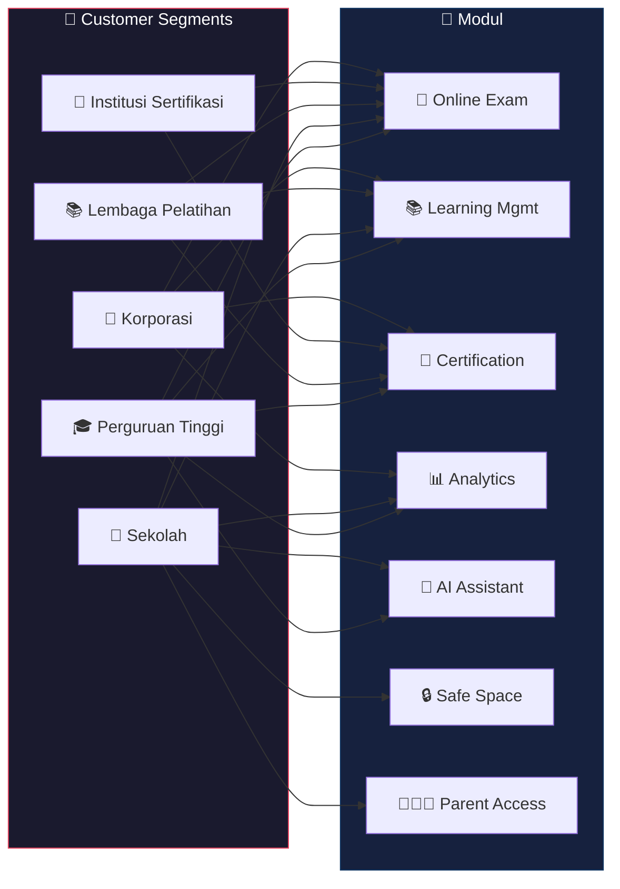

**Institusi yang Dapat Menggunakan Spinotek Learning System**

Spinotek Learning System dirancang untuk mendukung berbagai institusi yang memiliki kebutuhan dalam mengelola proses pembelajaran digital.

Dengan pendekatan modular dan fleksibel, platform ini dapat digunakan dalam berbagai konteks pembelajaran, mulai dari pendidikan formal hingga pelatihan profesional.

## Matrix Institusi × Modul

| Institusi | Exam | LMS | Certification | Analytics | AI | Safe Space | Parent Access |
|---|:---:|:---:|:---:|:---:|:---:|:---:|:---:|
| 🎓 **Perguruan Tinggi** | ✅ | ✅ | ✅ | ✅ | ✅ | — | — |
| 🏫 **Sekolah** | ✅ | ✅ | — | ✅ | ✅ | ✅ | ✅ |
| 📚 **Lembaga Pelatihan** | ✅ | ✅ | ✅ | — | — | — | — |
| 📜 **Institusi Sertifikasi** | ✅ | — | ✅ | — | — | — | — |
| 🏢 **Korporasi** | ✅ | ✅ | ✅ | ✅ | — | — | — |

---

# 1. Universities & Higher Education

**Perguruan Tinggi**

Perguruan tinggi membutuhkan sistem pembelajaran digital untuk mendukung proses belajar mengajar antara pengajar dan pelajar.

Spinotek Learning System dapat membantu perguruan tinggi dalam:

- Mengelola materi perkuliahan
- Menyelenggarakan ujian online
- Memantau progres pembelajaran pelajar
- Menganalisis performa pembelajaran

Dengan sistem ini, kampus dapat membangun ekosistem pembelajaran digital yang lebih terstruktur dan terintegrasi.

# 2. Schools

**Sekolah**

Sekolah membutuhkan sistem pembelajaran digital yang tidak hanya mendukung kegiatan belajar mengajar, tetapi juga menyediakan **ruang digital yang aman** bagi siswa, terutama dengan semakin ketatnya regulasi perlindungan anak di ruang digital.

Spinotek Learning System dapat membantu sekolah dalam:

- Distribusi materi pembelajaran
- Pengelolaan tugas siswa
- Penyelenggaraan ujian digital
- Pemantauan perkembangan siswa
- Menyediakan lingkungan digital yang aman dan terkontrol
- Memberikan akses bagi orang tua untuk memantau progres dan aktivitas belajar anak

Dengan fitur transparansi bagi orang tua, sekolah dapat membangun kepercayaan dan kolaborasi yang lebih baik antara institusi dan keluarga dalam mendukung proses belajar siswa.

# 3. Training Institutions

**Lembaga Pelatihan**

Lembaga pelatihan sering kali membutuhkan sistem untuk mengelola program pelatihan yang mereka selenggarakan.

Spinotek Learning System dapat digunakan untuk:

- Mengelola course pelatihan
- Memberikan materi pembelajaran
- Menyelenggarakan ujian atau evaluasi
- Memberikan sertifikat digital kepada peserta

Hal ini memungkinkan lembaga pelatihan mengelola program pembelajaran secara lebih profesional.

# 4. Certification Organizations

**Institusi Sertifikasi**

Beberapa organisasi menyelenggarakan program sertifikasi yang membutuhkan sistem untuk mengelola ujian dan verifikasi sertifikat.

Spinotek Learning System dapat membantu institusi sertifikasi dalam:

- Penyelenggaraan ujian sertifikasi
- Pengelolaan bank soal
- Penerbitan sertifikat digital
- Verifikasi sertifikat

Dengan sistem ini, proses sertifikasi dapat dilakukan secara lebih terstruktur dan transparan.

# 5. Corporate Learning & Training

**Pelatihan Internal Perusahaan**

Banyak perusahaan memiliki program pelatihan internal untuk meningkatkan kompetensi karyawan.

Spinotek Learning System dapat digunakan untuk:

- Program pelatihan karyawan
- Evaluasi pelatihan
- Sertifikasi internal
- Monitoring perkembangan kompetensi

Platform ini membantu perusahaan mengelola program pembelajaran internal secara lebih sistematis.

## Flexible for Various Learning Scenarios

Dengan arsitektur modular, Spinotek Learning System dapat menyesuaikan diri dengan berbagai kebutuhan institusi.

Institusi dapat menggunakan platform ini secara bertahap, dimulai dari satu modul seperti **Online Exam System**, kemudian berkembang menjadi sistem pembelajaran yang lebih lengkap.

Pendekatan ini memungkinkan adopsi teknologi pembelajaran yang lebih fleksibel dan berkelanjutan.