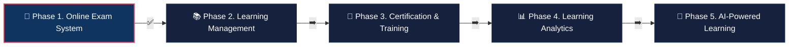
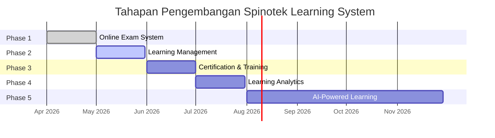

**Tahapan Pengembangan Spinotek Learning System**

Roadmap menjelaskan bagaimana Spinotek Learning System akan dikembangkan secara bertahap, dimulai dari modul yang paling dibutuhkan oleh institusi hingga berkembang menjadi platform pembelajaran digital yang lebih lengkap.

Pendekatan bertahap ini memungkinkan pengembangan sistem yang lebih fokus, sekaligus memberikan nilai nyata bagi institusi sejak tahap awal.

## Roadmap Visual

---

# Phase 1

**Online Exam System**

Tahap awal pengembangan difokuskan pada modul **Online Exam System**, yang menjadi kebutuhan penting bagi banyak institusi pendidikan.

Pada tahap ini, sistem akan menyediakan fitur utama seperti:

- Question Bank Management
- Exam Scheduling
- Randomized Question
- Automatic Grading
- Time Control
- Essay Submission

Modul ini dapat digunakan secara mandiri oleh institusi yang hanya membutuhkan sistem ujian digital.

Tahap ini juga menjadi entry point bagi institusi untuk mulai menggunakan Spinotek Learning System.

# Phase 2

**Learning Management System**

Setelah modul Online Exam System berjalan dengan stabil, pengembangan akan diperluas ke modul Learning Management.

Pada tahap ini, sistem akan menyediakan fitur seperti:

- Course Management
- Learning Materials
- Assignment Management
- Discussion Forum
- Student Progress Tracking

Dengan modul ini, institusi dapat mengelola proses pembelajaran secara lebih lengkap dalam satu platform.

# Phase 3

**Certification & Training Platform**

Tahap berikutnya adalah pengembangan modul untuk mendukung program pelatihan dan sertifikasi.

Fitur yang dapat dikembangkan pada tahap ini antara lain:

- Digital Certificate Generator
- Certificate Verification
- Credential Management

Modul ini memungkinkan platform digunakan oleh lembaga pelatihan maupun institusi yang menyelenggarakan program sertifikasi.

# Phase 4

**Learning Analytics**

Tahap selanjutnya adalah pengembangan modul analytics yang membantu institusi memahami proses pembelajaran secara lebih mendalam.

Dashboard analytics dapat menampilkan berbagai insight seperti:

- Tingkat partisipasi pelajar
- Progres pembelajaran
- Performa ujian
- Tingkat penyelesaian course

Analytics ini membantu institusi mengambil keputusan berbasis data dalam mengelola pembelajaran.

# Phase 5

**AI-Powered Learning Platform**

Tahap berikutnya adalah integrasi teknologi AI untuk meningkatkan pengalaman pembelajaran.

Fitur AI yang dapat dikembangkan antara lain:

- AI tutor untuk membantu pelajar memahami materi
- AI question generator untuk membantu pengajar membuat soal
- AI content summary untuk merangkum materi pembelajaran
- AI learning analytics untuk memberikan insight yang lebih mendalam

Integrasi AI akan memungkinkan Spinotek Learning System berkembang menjadi platform pembelajaran yang lebih adaptif dan cerdas.

## Long-Term Vision

Dalam jangka panjang, Spinotek Learning System diharapkan dapat berkembang menjadi platform pembelajaran digital yang mendukung berbagai kebutuhan institusi pendidikan dalam satu ekosistem terintegrasi.

Pendekatan modular memungkinkan platform ini terus berkembang mengikuti kebutuhan pendidikan dan perkembangan teknologi.