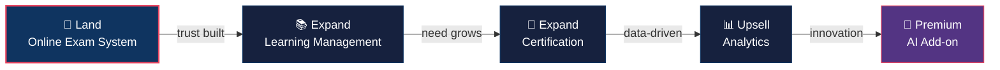
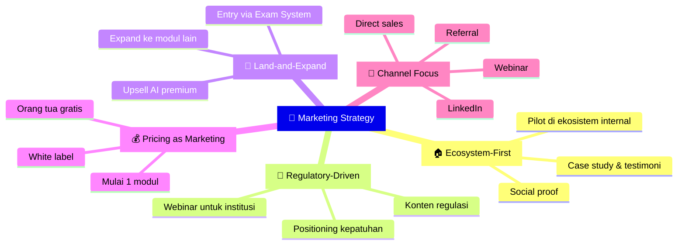

# Marketing Strategy

**Strategi Pemasaran Spinotek Learning System**

Spinotek Learning System adalah produk **B2B (Business-to-Business)** yang ditujukan untuk institusi pendidikan dan organisasi pelatihan.

Strategi pemasaran difokuskan pada pendekatan **consultative sales** yang mengedepankan edukasi, demonstrasi produk, dan membangun kepercayaan institusi.

## Pendekatan Pemasaran

```mermaid
graph LR
    subgraph PHASE1["🏠 Phase 1. Foundation"]
        P1A["Pilot di ekosistem internal"]
        P1B["Kumpulkan case study"]
        P1C["Dokumentasi metrics"]
    end

    subgraph PHASE2["📢 Phase 2. Awareness"]
        P2A["Content marketing regulasi"]
        P2B["Webinar & seminar"]
        P2C["Lead generation"]
    end

    subgraph PHASE3["🤝 Phase 3. Acquisition"]
        P3A["Direct sales"]
        P3B["Referral program"]
        P3C["Demo & presentasi"]
    end

    subgraph PHASE4["📈 Phase 4. Expansion"]
        P4A["Upsell modul"]
        P4B["Upgrade tier"]
        P4C["AI add-on"]
    end

    PHASE1 --> PHASE2 --> PHASE3 --> PHASE4

    style PHASE1 fill:#1a1a2e,stroke:#e94560,color:#ffffff
    style PHASE2 fill:#16213e,stroke:#0f3460,color:#ffffff
    style PHASE3 fill:#0f3460,stroke:#533483,color:#ffffff
    style PHASE4 fill:#533483,stroke:#e94560,color:#ffffff
```

---

## 1. Ecosystem-First Strategy

Spinotek memiliki keunggulan unik yang tidak dimiliki oleh kompetitor — **ekosistem pendidikan yang sudah aktif**.

Ekosistem ini mencakup Guruinovatif.id, HAFECS, TNYI, SMP-SMA GIBS, Politeknik Hasnur, BCTI, BIM University, dan Codero.

### Langkah:

- Jadikan **2–3 institusi** dalam ekosistem sebagai pilot customer
- Dokumentasikan hasil implementasi secara detail (metrics penggunaan, testimoni, dampak)
- Gunakan hasilnya sebagai **social proof** untuk pitching ke institusi di luar ekosistem

### Target Output:

- Case study tertulis dengan data konkret
- Video testimoni dari pengajar dan pimpinan institusi
- Metrics penggunaan (jumlah ujian, pelajar aktif, engagement rate)

> Social proof dari pengguna nyata jauh lebih efektif daripada presentasi fitur dalam konteks B2B.

---

## 2. Regulatory-Driven Marketing

Diterbitkannya **Peraturan Menteri Komunikasi dan Digital Nomor 9 Tahun 2026** yang membatasi akses anak di bawah 16 tahun ke platform digital berisiko tinggi menciptakan **trigger event** yang dapat dimanfaatkan.

### Langkah:

- Buat konten edukatif tentang implikasi regulasi terhadap dunia pendidikan
- Selenggarakan **webinar gratis** untuk kepala sekolah dan pimpinan institusi
- Posisikan Spinotek Learning System sebagai **solusi kepatuhan regulasi**, bukan sekadar LMS

### Topik Konten:

- "Bagaimana Sekolah Anda Menyiapkan Ruang Digital Aman bagi Siswa?"
- "Implikasi PP TUNAS bagi Institusi Pendidikan"
- "Mengapa Institusi Perlu Platform Pembelajaran Sendiri"

### Channel Distribusi Konten:

- LinkedIn (artikel dan post)
- Guruinovatif.id (leverage sebagai media edukasi)
- Email marketing ke database institusi
- Webinar dan seminar online

---

## 3. Land-and-Expand Strategy

Sesuai dengan roadmap produk, strategi akuisisi menggunakan pendekatan **land-and-expand**:

### Langkah:

- Tawarkan modul **Online Exam System** sebagai entry product dengan biaya rendah
- Setelah institusi merasakan manfaat, tawarkan modul tambahan secara bertahap
- Gunakan data penggunaan untuk menunjukkan potensi value dari modul lain

### Keunggulan Pendekatan Ini:

- Barrier to entry rendah bagi institusi
- Institusi bisa membuktikan value sebelum investasi lebih besar
- Revenue per institusi meningkat secara natural seiring waktu

---

## 4. Pricing sebagai Marketing Tool

Model pricing Spinotek Learning System dirancang untuk menjadi alat pemasaran:

| Elemen Pricing | Dampak Marketing |
|---|---|
| **Akses orang tua GRATIS** | Selling point sangat kuat untuk sekolah — orang tua mendapat value tanpa biaya tambahan |
| **Mulai dari 1 modul** | Mengurangi barrier to entry, institusi tidak perlu komitmen besar di awal |
| **Tier-based, bukan per-user** | Predictable cost, institusi tidak takut mendaftarkan semua pengguna |
| **White label** | Institusi merasa platform ini milik mereka, meningkatkan sense of ownership |
| **Diskon kontrak tahunan** | Mendorong komitmen jangka panjang dan stabilitas cashflow |

---

## 5. Channel Marketing

### Prioritas Tinggi

| Channel | Taktik |
|---|---|
| **Direct Sales** | Presentasi ke kepala sekolah, rektor, dekan, HRD perusahaan |
| **Webinar & Seminar** | Topik regulasi dan transformasi digital pendidikan |
| **Referral** | Insentif bagi institusi yang merekomendasikan ke institusi lain |
| **Guruinovatif.id** | Leverage sebagai channel edukasi dan awareness |

### Prioritas Menengah

| Channel | Taktik |
|---|---|
| **LinkedIn** | Konten thought-leadership, case study, insight pendidikan |
| **Email Marketing** | Nurturing leads dengan konten edukatif berkala |
| **Partnership** | Kerjasama dengan asosiasi pendidikan dan dinas pendidikan |

### Tidak Direkomendasikan

| Channel | Alasan |
|---|---|
| **Google/Meta Ads** | Kurang efektif untuk B2B institusi, cost per acquisition tinggi |
| **Social media umum** | Target market (pengambil keputusan institusi) tidak aktif di platform konsumen |

---

## Ringkasan Strategi

