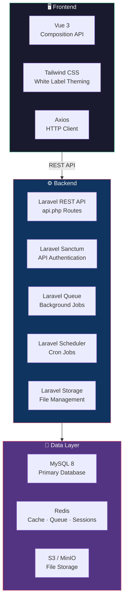
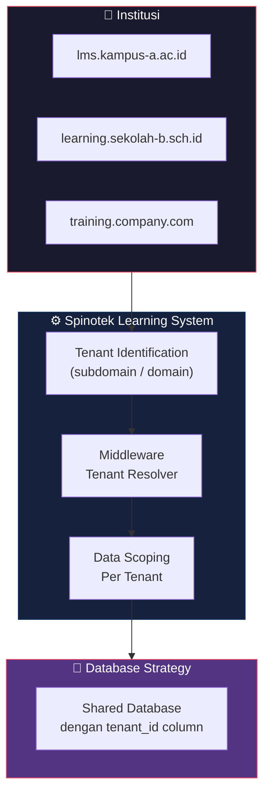
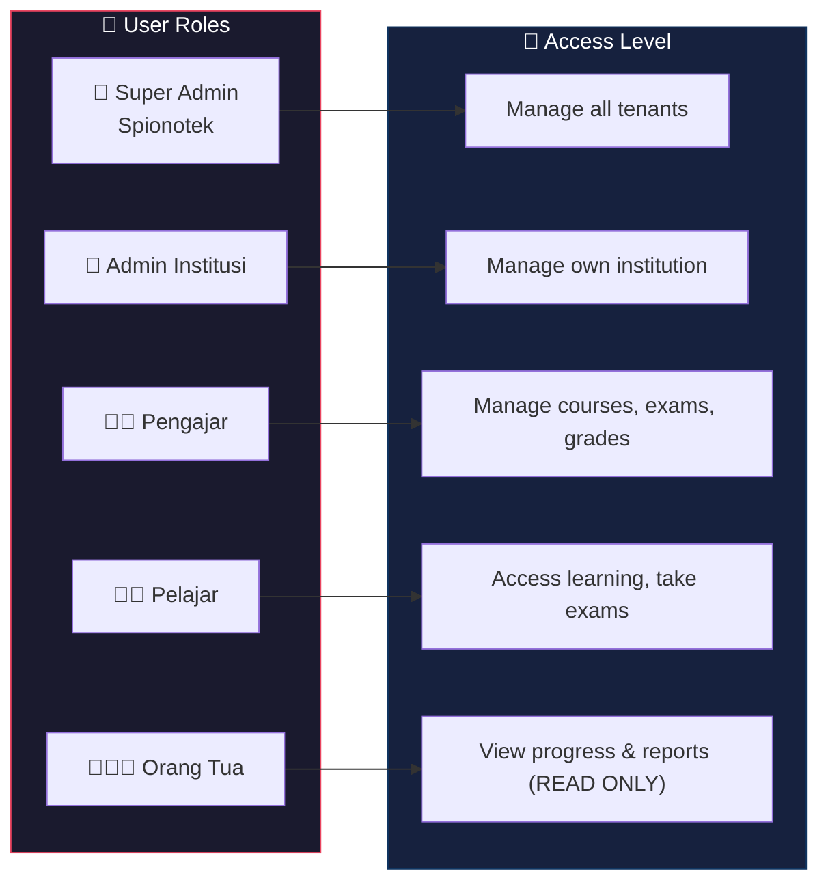
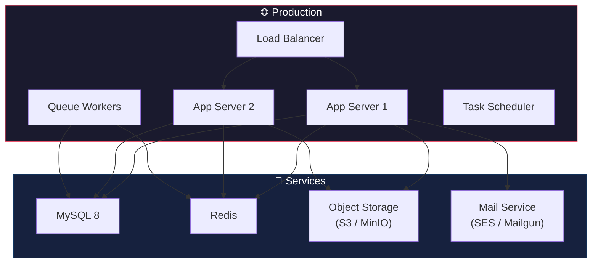

# Tech Stack

**Arsitektur Teknis Spinotek Learning System**

Spinotek Learning System dibangun menggunakan teknologi modern yang telah dikuasai oleh tim, dengan fokus pada produktivitas pengembangan, performa, dan kemampuan untuk berkembang.

## Stack Utama



| Layer | Teknologi | Versi | Peran |
|---|---|---|---|
| **Frontend** | Vue 3 | 3.x (Composition API) | UI interaktif, komponen reusable |
| **Styling** | Tailwind CSS | 3.x / 4.x | Styling utility-first, white-label theming |
| **HTTP Client** | Axios | — | Request ke REST API Laravel |
| **Build Tool** | Vite | — | Bundling frontend (built-in Laravel) |
| **Backend** | Laravel | 11+ | REST API, auth, business logic, multi-tenancy |
| **Auth** | Laravel Sanctum | — | Token-based API authentication |
| **Database** | MySQL | 8.x | Data utama (user, soal, ujian, course, dll) |
| **Cache** | Redis | 7.x | Caching, queue driver, session store |
| **Storage** | S3 / MinIO | — | File materi, tugas, sertifikat PDF |

---

## Arsitektur Frontend

Vue 3 diinstall langsung di dalam project Laravel melalui **Vite** (sudah built-in di Laravel).

Frontend berkomunikasi dengan backend melalui **REST API** menggunakan **Axios**.

```
resources/
├── js/
│   ├── app.js              → Entry point Vue
│   ├── components/         → Komponen reusable
│   ├── composables/        → Composition API logic
│   ├── pages/              → Halaman utama
│   ├── stores/             → Pinia state management
│   └── api/                → API service layer (axios)
├── views/
│   └── app.blade.php       → Single Blade entry point
└── css/
    └── app.css             → Tailwind CSS
```

**Keuntungan pendekatan ini:**

- **Satu project, satu repo** — Vue dan Laravel dalam satu codebase
- **Load data cepat** — Vue fetch data via REST API secara async, bisa parallel request
- **Full kontrol** — Bisa lazy-load komponen, caching response, optimistic UI
- **API reusable** — API yang sama bisa dipakai untuk mobile app nanti
- **Familiar** — Tim sudah terbiasa dengan pola Laravel API + Vue

---

## Arsitektur Multi-Tenancy



**Pendekatan:** Shared database dengan kolom `tenant_id` pada setiap tabel.

**Package:** `stancl/tenancy` untuk otomatis resolve tenant berdasarkan domain dan scoping data.

**Alasan:**
- Lebih efisien untuk fase awal (1 database, 1 deployment)
- Mudah di-maintain dibanding multi-database
- Bisa migrasi ke database per-tenant nanti jika diperlukan

---

## Role & Permission



**Package:** `spatie/laravel-permission`

| Role | Deskripsi | Akses |
|---|---|---|
| **Super Admin** | Tim Spinotek | Kelola semua tenant dan konfigurasi sistem |
| **Admin Institusi** | Staff institusi | Kelola institusi mereka (user, setting, branding) |
| **Pengajar** | Dosen / guru / trainer | Kelola course, soal, ujian, nilai |
| **Pelajar** | Siswa / mahasiswa / peserta | Akses materi, ikut ujian, lihat nilai |
| **Orang Tua** | Wali siswa | Lihat progres & laporan anak (read-only) |

---

## Package Ecosystem

### Core Packages

| Package | Fungsi |
|---|---|
| `laravel/framework` | Core backend |
| `laravel/sanctum` | API token authentication |
| `stancl/tenancy` | Multi-tenant architecture |
| `spatie/laravel-permission` | Role-based access control |

### Feature Packages

| Package | Fungsi | Modul |
|---|---|---|
| `barryvdh/laravel-dompdf` | Generate sertifikat PDF | Certification |
| `maatwebsite/laravel-excel` | Import/export soal & nilai | Exam, Analytics |
| `spatie/laravel-medialibrary` | Upload materi & file | LMS |
| `laravel/reverb` | WebSocket real-time | Exam (timer), Notification |
| `openai-php/laravel` | Integrasi OpenAI API | AI modules |

### Development & DevOps

| Tool | Fungsi |
|---|---|
| `laravel/pint` | Code style & formatting |
| `pestphp/pest` | Testing framework |
| `laravel/telescope` | Debugging & monitoring (dev) |
| `laravel/horizon` | Queue monitoring (production) |
| `laravel/forge` / Ploi | Server deployment |

---

## White Label Theming

Tailwind CSS sangat cocok untuk white-label karena warna bisa dikonfigurasi secara dinamis:

```
Setiap tenant memiliki konfigurasi:
├── Primary Color     → Warna utama institusi
├── Secondary Color   → Warna aksen
├── Logo              → Logo institusi
├── Favicon           → Favicon institusi
├── Domain            → Custom domain
└── Email Identity    → Nama pengirim email
```

Implementasi menggunakan CSS custom properties yang di-set berdasarkan tenant config, sehingga Tailwind classes tetap sama tapi warna berubah per institusi.

---

## Infrastruktur Deployment



| Opsi Deployment | Keterangan |
|---|---|
| **Cloud Hosted** | Di-manage Spinotek (DigitalOcean / AWS) via Laravel Forge |
| **On-Premise** | Di-host di server institusi (untuk kebutuhan data sovereignty) |
| **Hybrid** | Kombinasi cloud + on-premise sesuai kebijakan institusi |

---

## Ringkasan Arsitektur

```
┌──────────────────────────────────────────────────────┐
│                    FRONTEND                          │
│           Vue 3 + Tailwind CSS + Axios               │
│              (via Vite, dalam Laravel)                │
├──────────────────────────────────────────────────────┤
│                    REST API                          │
│              Laravel Sanctum (auth)                   │
├──────────────────────────────────────────────────────┤
│                    BACKEND                           │
│    Laravel 11+ (API Routes, Multi-Tenancy)            │
│    Queue · Scheduler · Storage · Broadcasting        │
├──────────────────────────────────────────────────────┤
│                   DATA LAYER                         │
│           MySQL 8 · Redis · S3/MinIO                 │
└──────────────────────────────────────────────────────┘
```
